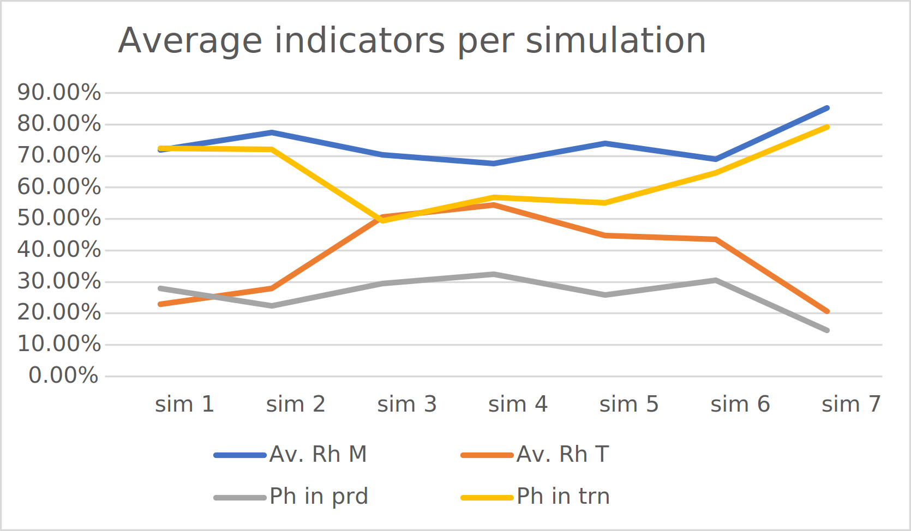

# What this branch is about?

This brach is an extension of the paper titled **A Graphical and Executable Model for Production Simulation in the Context of Industry 5.0** to be presented in the [2022 IEEE International Symposium on Industrial Electronics](https://www.ieee-isie2022.org/).

It contains the the **PRESIB Model** presented in the paper and also the data and description of the performed simulations.

The pourpose of this bracn is to "freeze" the model and all the data related to the production of the paper for future reference.

# PRESIB

**PRESIB** (**P**roduct, **RE**source, **S**ervices **I**nteraction & **B**ehavior) is an Holionic Manufacturing System architecture When compared to PROSA (**P**roduct-**R**esource-**O**rder-Staff **A**rchitecture), **PRESIB** shares some similarities with **PROSIS**(**P**roduct, Resource, **O**rder & Simulation **I**soarchic System), like the suppression of the _Staff holon_. As **PROSIS**, **PRESIB** is distributed and self-organized systems that try to achieve optimal behavior based on the state of the holons in a real-time scenario.

**PRESIB** proposes a service interaction on the manufacturing process instead of a control or scheduling system. It considers that the holons share a common goal and will try to achieve it the best way possible. In **PRESIB**, there are only two holon types: **P**roduct **h**olon (Ph) and Resource **h**olon (Rh). The **O**rder **h**olon (Oh) responsibilities have been split between the Ph and Rh.. The order knowledge and production plan are the responsibility of the Ph, while the quality control of the task is the responsibility of the Rh, since it is the one providing the service. This framework leads to a simpler system and an approach where the shop floor becomes a service provider for the product. This is achieved because the Rh provides the available services and ”exposes” them on the shop floor. At the same time, the Ph will consume the available services when needed following his execution plan and the availability of such services. From the autonomous interaction of each holon, providing or consuming the services, the behavior of the entire system can be observed.

# PRESIB MODEL

The proposed **PRESIB** model was built with Reference Nets, a high-level Petri nets class supporting object-oriented design. These modeling capabilities make Reference nets particularly suitable for HMS-based architectures’ specifications. Also, it provides the capacity to extend the model using the Java programming language, which offers the possibility to connect the PRESIB model to the physical devices having multiple CPS, where each CPS is the holon on the HMS architecture.

The model is composed of four main nets:

1. **Playground** net, represents the interactions in the shop-floor; it is where the services are published; it is also where the other main nets are instantiated and interaction takes place;
2. **Item Ph net**, representes the product to be produced;
3. **Rh net machine**, represents the availables machines on the shop floor;
4. **Rh net transports**, represents the available transporters.

# PRESIB SIMULATION

## Theorical use case

Having in the [European expecitications for the industry 5.0](https://ec.europa.eu/info/research-and-innovation/research-area/industrial-research-and-innovation/industry-50_en) and the adoption of mass customization in product manufacturing, the following theorical use case was concibed:

> A teorical manufacturing facility needs to understand what will ne the best combination of resources in order to produce 1000 items using a production a best-effort per product without accounting for time.
>
> The best combinations of resources means the major number of machines in production and the major number of transporters in use, having the minor value of producs in waiting state.
>

For this pourpose the seven simulations, using the **PRESIB** Model, were made with variable number of machines and transporters available in the shop floor.

Available resources per simulation:

|                  | Simulation 1 | Simulation 2 | Simulation 3 | Simulation 4 | Simulation 5 |
| ---------------- | ------------ | ------------ | ------------ | ------------ | ------------ |
| **Machines**     | 8            | 16           | 8            | 16           | 32           |
| **Transporters** | 6            | 6            | 12           | 12           | 12           |

## Analisys process

The analisys process was done recuring to the logs generated by the model execution and the extration of data executed by an utility ([Ponos](https://github.com/PRESIB/ponos/tree/paper)) developed for this pourpose. The source code is available in a public repositoty under the PRESIB project on [GitHub](https://github.com/PRESIB/ponos/tree/paper).

> :information_source: **Note**: Take in consideration that you should use the branch [paper](https://github.com/PRESIB/ponos/tree/paper) since is the exact same code used to process the information extrated from the logs produced by the ecxecution of the model on this brach.

Ponos generate a CSV file out of the log of a simulation. After the seven simulations the correspondent CSV files were imported into a spread sheet in order to generate the charts that support the interpretation of each simulation.

# Global analisys

The following table presents the results from the performed simulations:

#### Table 1 

Avarage indicators per simulation in percentage

|             | Inputs |          |         | RESULTS  |          |            |            |
| ----------- | :----: | -------- | ------- | :------: | -------- | ---------- | ---------- |
| Simulations |   Ph   | Rh Mach. | Rh Trn. | Av. Rh M | Av. Rh T | Ph in prd. | Ph in trn. |
| sim1        |  1000  | 8        | 6       |  71,97%  | 22,90%   | 27,99%     | 72,48%     |
| sim2        |  1000  | 16       | 6       |  77,54%  | 27,89%   | 22,41%     | 72,10%     |
| sim3        |  1000  | 8        | 12      |  70,46%  | 50,61%   | 29,51%     | 49,39%     |
| sim4        |  1000  | 16       | 12      |  67,59%  | 54,43%   | 32,37%     | 56,85%     |
| sim5        |  1000  | 32       | 12      |  74,10%  | 44,79%   | 25,77%     | 55,19%     |
| sim6        |  1000  | 48       | 12      |  68,98%  | 43,55%   | 30,62%     | 64,74%     |
| sim7        |  1000  | 12       | 3       |  85,33%  | 20,72%   | 14,62%     | 79,28%     |

#### Chart 1

#### 

[Chart 1](#chart-1) use the values from [Table 1](#table-1).

### Legend:

- **Ph** - *Product holon* -  an instance of the net that represents the product to be made;
- **Rh Mach.** - *Resource holon Machine* - an instance of the net that represents a machine;
- **Rh Trn.** - *Resource holon Transporter* - an instance of the net that represents a transporter;
- **Av. Rh M** - Avarage available number of Rh Mach. on the simulation;
- **Av. Rh T** - Avarage available number of Rh Trn. on the simulation;
- **Ph in prd** - Avarage number of Ph on production;
- **Ph in trn** - Avarage number of Ph on transit;

The values presented on [Table 1](#table-1) indicates that sim 4 presents the best combinations between in indicators acording the defenition on [Theorical use case](#Theorical-use-case)

For more details in the data collected and generated charts please consult the following links:

- [**Sim 1**](simulation/SIMULATION_1_RESULTS.MD)
- **Sim 2**
- **Sim 3**
- **Sim 4**
- **Sim 5**
- **Sim 6**
- **Sim 7**
